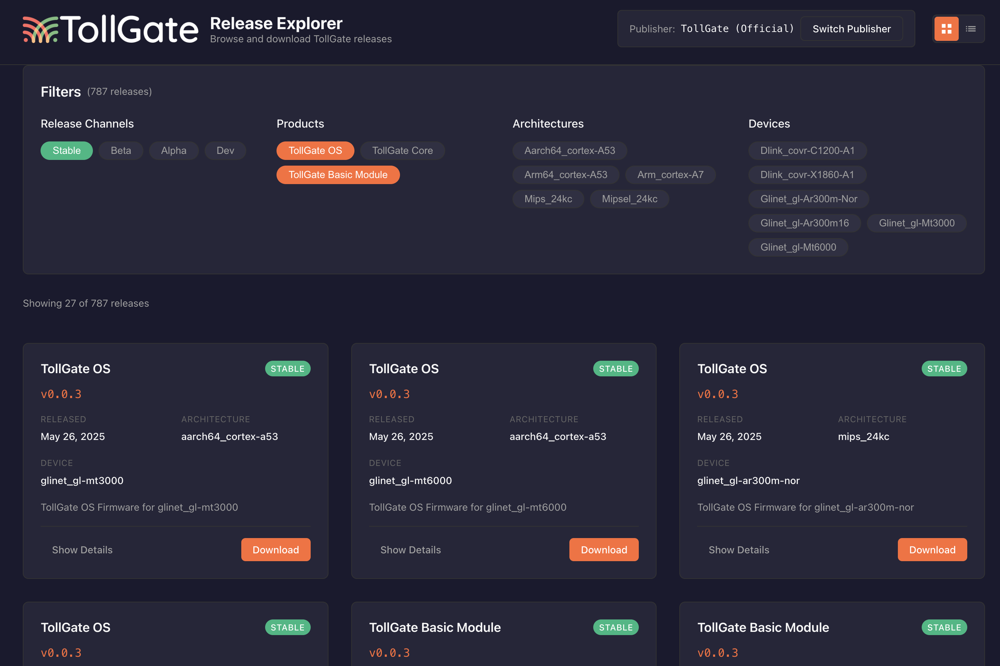

# TollGate Release Explorer



A static web application for browsing and downloading TollGate OS and Core releases via Nostr NIP-94 events.

## Features

- **Release Browsing**: View releases in both grid and list formats
- **Smart Filtering**: Filter by release channels (stable, beta, alpha, dev), product types, architectures, and devices
- **Publisher Management**: Browse releases from the official TollGate pubkey or switch to custom publishers
- **Detailed Download Pages**: Comprehensive release information, installation instructions, and file verification
- **Developer Tools**: View raw NIP-94 events for debugging and development
- **Responsive Design**: Optimized for desktop, tablet, and mobile devices

## Technology Stack

- **Frontend**: React 18 with functional components
- **Styling**: Styled-components with TollGate branding
- **Nostr Integration**: @nostr-dev-kit/ndk for NIP-94 release events
- **Routing**: React Router for navigation
- **State Management**: React Context + hooks

## Quick Start

### Prerequisites

- Node.js 16+ 
- npm or yarn

### Installation

1. Clone the repository:
```bash
git clone <repository-url>
cd tollgate-release-explorer
```

2. Install dependencies:
```bash
npm install
```

3. Start the development server:
```bash
npm start
```

4. Open [http://localhost:3000](http://localhost:3000) in your browser

### Building for Production

```bash
npm run build
```

The built files will be in the `build` directory, ready for deployment to any static hosting service.

## Usage

### Main Interface

- **Grid/List Toggle**: Switch between card-based grid view and compact list view
- **Publisher Selector**: Switch between official TollGate releases and custom pubkeys
- **Filter Bar**: Apply filters by channel, product type, architecture, and device

### Filtering Releases

- **Channels**: stable (default), beta, alpha, dev
- **Products**: TollGate OS (firmware images), TollGate Core (packages)
- **Architecture**: Filter by target architecture (e.g., aarch64_cortex-a53)
- **Devices**: Filter by specific device models

### Download Process

1. Click on any release card or "Download" button
2. Review release details and installation instructions
3. Verify file integrity using the provided SHA-256 hash
4. Click "Download Release" to get the file

### Publisher Management

- Default: Official TollGate pubkey for verified releases
- Custom: Enter any Nostr pubkey to browse alternative publishers
- The app validates pubkey format (64-character hex strings)

## Architecture

### File Structure

```
src/
├── components/          # React components
│   ├── common/         # Reusable UI components
│   ├── filters/        # Filter controls
│   ├── layout/         # Layout components
│   ├── publisher/      # Publisher management
│   ├── releases/       # Release browsing components
│   └── download/       # Download page
├── contexts/           # React contexts
├── styles/             # Theme and styling
├── utils/              # Utility functions
└── constants/          # App constants
```

### Key Components

- **NostrReleaseProvider**: Manages Nostr connections and release data
- **ReleaseExplorer**: Main browsing interface with filtering
- **ReleaseCard/ReleaseList**: Release display components
- **DownloadPage**: Detailed release information and download
- **FilterBar**: Release filtering controls
- **PublisherModal**: Publisher switching interface

### Data Flow

1. App initializes NDK connection to Nostr relays
2. Subscribes to NIP-94 events from current publisher
3. Processes and filters releases based on user criteria
4. Displays releases in selected view mode
5. Provides detailed download pages with verification info

## NIP-94 Event Structure

The app expects NIP-94 file metadata events with these tags:

```json
{
  "kind": 1063,
  "tags": [
    ["url", "download_url"],
    ["m", "mime_type"],
    ["x", "file_hash"],
    ["architecture", "target_architecture"],
    ["device_id", "device_identifier"],
    ["supported_devices", "device1,device2"],
    ["openwrt_version", "openwrt_version"],
    ["tollgate_os_version", "version"] // or tollgate_core_version
    ["release_channel", "stable|beta|alpha|dev"]
  ],
  "content": "Release description"
}
```

## Customization

### Styling

The app uses a theme system defined in `src/styles/theme.js`. Key customization points:

- Colors: Primary, background, text colors
- Typography: Font sizes, weights
- Spacing: Consistent spacing scale
- Breakpoints: Responsive design breakpoints

### Default Configuration

- **Default Publisher**: TollGate official pubkey
- **Default Relays**: Damus, Nostr Band, nos.lol, Snort
- **Default Filters**: Stable channel only, all products
- **View Mode**: Grid view (cards)

### Mock Data

When no releases are found from the official TollGate pubkey, the app displays mock releases for testing and demonstration purposes.

## Development

### Available Scripts

- `npm start`: Start development server
- `npm run build`: Build for production
- `npm test`: Run tests
- `npm run eject`: Eject from Create React App

### Adding New Features

1. **New Filters**: Add filter logic to `utils/releaseUtils.js`
2. **UI Components**: Follow styled-components patterns in `components/common/`
3. **Nostr Integration**: Extend `contexts/NostrReleaseContext.js`

## Deployment

The app can be deployed to any static hosting service:

### Netlify
```bash
npm run build
# Deploy the build/ directory
```

### Vercel
```bash
npm run build
# Deploy the build/ directory
```

### Cloudflare Pages (Recommended)
```bash
# Install Wrangler CLI
npm install -g wrangler

# Login to Cloudflare
wrangler login

# Deploy to preview
npm run deploy:preview

# Deploy to production
npm run deploy:production
```

### GitHub Pages
```bash
npm install --save-dev gh-pages
npm run build
npx gh-pages -d build
```

## Browser Support

- Chrome 90+
- Firefox 88+
- Safari 14+
- Edge 90+

## Contributing

1. Fork the repository
2. Create a feature branch
3. Make your changes
4. Test thoroughly
5. Submit a pull request

## License

MIT License - see LICENSE file for details

## Support

For issues and questions:
- Create an issue in the repository
- Check the documentation in `docs/architecture.md`
- Review the code comments for implementation details