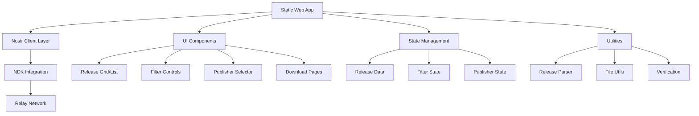
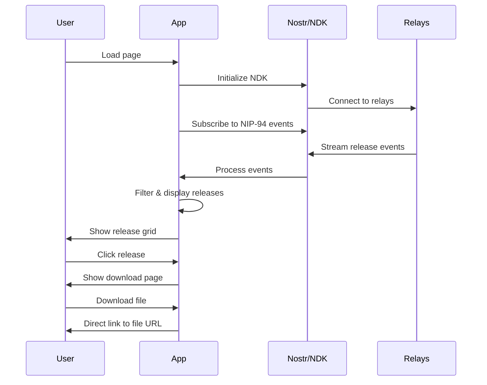

# TollGate Release Explorer - Architecture Document

## 📋 Project Overview

**Project Name:** TollGate Release Explorer  
**Type:** Static Web Application (Nostr Client)  
**Purpose:** Browse, filter, and download TollGate OS and Core releases via NIP-94 events

## 🎯 Key Features

### 1. Release Browsing
- Hybrid view: Card-based grid (default) with list view toggle
- Filter by release channels: stable, beta, alpha, dev (default: stable only)
- Filter by product type: TollGate OS, TollGate Core
- Filter by architecture/device compatibility

### 2. Publisher Management
- Default TollGate pubkey loaded on startup
- "Switch Publisher" button for custom pubkey input
- Persist publisher selection in localStorage

### 3. Release Details
- Custom download page for each release
- Installation instructions and release notes
- File verification information (hash, size)
- Collapsible raw NIP-94 event display for developers

### 4. User Interface
- Styled using reference-captive-portal design system
- Dark theme with animated particle background
- Responsive design for mobile and desktop
- TollGate branding and logos

## 🏗️ Architecture



## 📁 File Structure

```
tollgate-release-explorer/
├── public/
│   ├── index.html
│   ├── manifest.json
│   └── assets/
│       └── tollgate-logos/
├── src/
│   ├── components/
│   │   ├── common/
│   │   │   ├── Background.js
│   │   │   ├── Button.js
│   │   │   ├── Card.js
│   │   │   └── Layout.js
│   │   ├── filters/
│   │   │   ├── ChannelFilter.js
│   │   │   ├── ProductFilter.js
│   │   │   └── ArchitectureFilter.js
│   │   ├── releases/
│   │   │   ├── ReleaseGrid.js
│   │   │   ├── ReleaseList.js
│   │   │   ├── ReleaseCard.js
│   │   │   └── ReleaseDetail.js
│   │   ├── publisher/
│   │   │   └── PublisherSelector.js
│   │   └── download/
│   │       └── DownloadPage.js
│   ├── contexts/
│   │   └── NostrReleaseContext.js
│   ├── hooks/
│   │   ├── useNostrReleases.js
│   │   └── useLocalStorage.js
│   ├── utils/
│   │   ├── releaseUtils.js
│   │   ├── nostrUtils.js
│   │   └── downloadUtils.js
│   ├── styles/
│   │   ├── GlobalStyles.js
│   │   ├── theme.js
│   │   └── components.js
│   ├── constants/
│   │   └── index.js
│   └── App.js
├── package.json
└── README.md
```

## 🔧 Technical Stack

- **Frontend:** React 18 with functional components
- **Styling:** Styled-components (matching reference-captive-portal)
- **Nostr:** @nostr-dev-kit/ndk for NIP-94 events
- **State Management:** React Context + hooks
- **Build:** Create React App or Vite
- **Deployment:** Static hosting (Netlify, Vercel, or GitHub Pages)

## 🎨 UI/UX Design

### Color Scheme (from reference-captive-portal)
- **Background:** Dark gradient (#1a1a2e to #16213e)
- **Primary:** TollGate orange/brand colors
- **Text:** Light colors (#f8f8f8)
- **Cards:** Semi-transparent dark backgrounds
- **Accents:** Subtle animations and particle effects

### Layout Structure
1. **Header:** TollGate logo, publisher selector, view toggle
2. **Filters:** Horizontal filter bar (channel, product, architecture)
3. **Main Content:** Release grid/list with search
4. **Footer:** Links, version info

## 📊 Data Flow



## 🔄 NIP-94 Event Structure

Based on the reference example, each release event contains:

```json
{
  "kind": 1063,
  "tags": [
    ["url", "https://example.com/file.bin"],
    ["m", "application/octet-stream"],
    ["x", "file_hash"],
    ["ox", "original_file_hash"],
    ["architecture", "aarch64_cortex-a53"],
    ["device_id", "glinet_gl-mt3000"],
    ["supported_devices", "device1,device2"],
    ["openwrt_version", "24.10.1"],
    ["tollgate_os_version", "develop.162.21324e8"],
    ["release_channel", "dev"]
  ],
  "content": "Release description"
}
```

## 🔒 Security Considerations

- **Content Security Policy:** Restrict external resources
- **Input Validation:** Sanitize pubkey inputs
- **Download Safety:** Display file hashes for verification
- **Privacy:** No tracking, purely client-side
- **HTTPS:** Ensure secure connections to relays

## 📱 Responsive Design

- **Mobile First:** Touch-friendly interface
- **Tablet:** Optimized grid layouts
- **Desktop:** Full feature set with keyboard shortcuts
- **Accessibility:** ARIA labels, keyboard navigation

## 🚀 Performance Optimization

- **Lazy Loading:** Load releases as needed
- **Caching:** Store releases in localStorage
- **Debounced Search:** Efficient filtering
- **Image Optimization:** Compressed assets
- **Bundle Splitting:** Code splitting for larger features

## 🧪 Testing Strategy

- **Unit Tests:** Utility functions and components
- **Integration Tests:** Nostr connectivity
- **E2E Tests:** User workflows
- **Performance Tests:** Large dataset handling

## 📦 Deployment

- **Build Process:** Optimized static build
- **CDN:** Asset delivery optimization
- **Domain:** Custom domain with SSL
- **Analytics:** Privacy-focused usage tracking (optional)

## 🔄 Future Enhancements

1. **Offline Support:** Service worker for caching
2. **Advanced Filters:** Date ranges, file size filters
3. **Bulk Downloads:** Multiple release downloads
4. **Release Notifications:** New release alerts
5. **API Integration:** REST API for external tools
6. **Multi-language:** Internationalization support

## 📋 Implementation Phases

### Phase 1: Core Foundation
- Basic React app setup
- NDK integration
- Release data fetching
- Simple list view

### Phase 2: UI Polish
- Styled-components integration
- TollGate theming
- Card-based grid view
- Filter controls

### Phase 3: Advanced Features
- Publisher switching
- Download pages
- Release detail views
- Developer tools (raw events)

### Phase 4: Production Ready
- Performance optimization
- Error handling
- Mobile responsiveness
- Testing & deployment

## 🎯 Success Criteria

1. **Functionality:** Successfully fetches and displays TollGate releases
2. **Usability:** Intuitive interface for both technical and non-technical users
3. **Performance:** Fast loading and responsive filtering
4. **Reliability:** Handles network failures gracefully
5. **Maintainability:** Clean, documented code structure